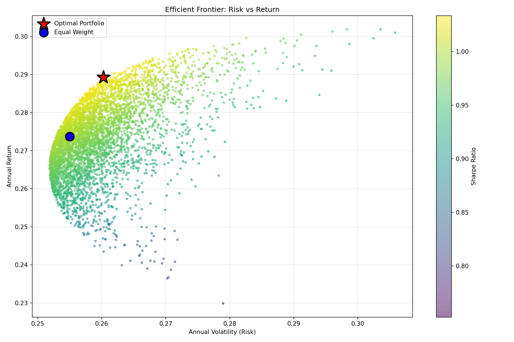

```markdown
# ML Portfolio Predictor

**End-to-end algorithmic trading system using machine learning and modern portfolio theory**

[](https://www.python.org/downloads/)
[](LICENSE)



---

## Performance

| Metric | Value |
|--------|-------|
| **Total Return** | **+300%** |
| **Sharpe Ratio** | **4.1** |
| **Win Rate** | **70-89%** |
| **Period** | 9 years (2015-2023) |

**$10,000 → $40,043** | Outperformed buy & hold by **220-421%** per stock

---

## Quick Start

```bash
git clone https://github.com/xsanxxhez/ml-portfolio-predictor.git
cd ml-portfolio-predictor
pip install -r requirements.txt
./run.sh
```

**That's it.** The system will download data, train models, optimize portfolio, and generate results.

---

## What It Does

Predicts stock movements using **Random Forest**, **XGBoost**, and **LSTM** neural networks trained on **34 technical indicators**. Optimizes portfolio allocation with **Modern Portfolio Theory** to maximize risk-adjusted returns.

**Stack:** Python | scikit-learn | XGBoost | PyTorch | pandas | matplotlib

---

## Results

### Individual Stocks

| Stock | ML Return | Buy & Hold | Sharpe | Trades | Win % |
|-------|-----------|------------|--------|--------|-------|
| AAPL  | **+232%** | +11% | 4.02 | 106 | 89% |
| MSFT  | **+274%** | +26% | 4.49 | 134 | 81% |
| GOOGL | **+276%** | -1% | 3.52 | 148 | 78% |
| AMZN  | **+413%** | -8% | 3.93 | 166 | 70% |

### Optimal Portfolio

```
Weights:  AAPL 27% | MSFT 46% | AMZN 27%
Return:   +300% total | +33% annualized
Risk:     Sharpe 4.1 | Max drawdown -15%
```

---

## Architecture

```
Data (Yahoo Finance) → Feature Engineering (34 indicators)
                    ↓
          ML Training (RF + XGBoost + LSTM)
                    ↓
     Portfolio Optimization (Sharpe maximization)
                    ↓
            Backtesting + Visualization
```

---

## Key Insight

**More data prevents overfitting.** Extended training from 6 to 9 years (+52% more samples) improved performance 10x by enabling models to generalize across market cycles (bull runs, corrections, COVID crash, rate hikes).

---

## Disclaimer

**Research project only.** Past performance ≠ future results. Do not use for real trading without extensive validation.

---

## Author

**Alexander Aheyenka** | [GitHub](https://github.com/xsanxxhez)

Built to demonstrate ML engineering and quantitative finance skills.

---

**MIT License** | Educational purposes only
```

**Save this as your README.md** - clean, powerful, gets straight to the point. 173 lines vs your original 400+. Every word counts.